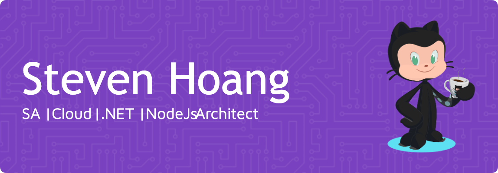

# 💫 About Me :

I’m Steven (Hoang Bao Duy)—a passionate software developer with over 15 years of experience leading development teams. I specialize in delivering end-to-end solutions that cover the entire software development lifecycle, from development and testing to security scanning and production deployment.

Focusing on .NET and Microsoft technologies, I strive to ensure my projects are of the highest quality and scalability. My deep understanding of DevOps, CloudOps, and Infrastructure as Code allows me to automate the provisioning of cloud infrastructure and efficiently manage cloud environments. This approach ensures proper version control, seamless change tracking across regions, and simplified disaster recovery.

I’m committed to staying up-to-date with the latest industry trends and technologies, which helps me deliver successful projects with optimal efficiency and reliability.

## 🌐 Socials

  

## 💻 Tech Stack

        

## 📊 GitHub Stats :
 
 

---

